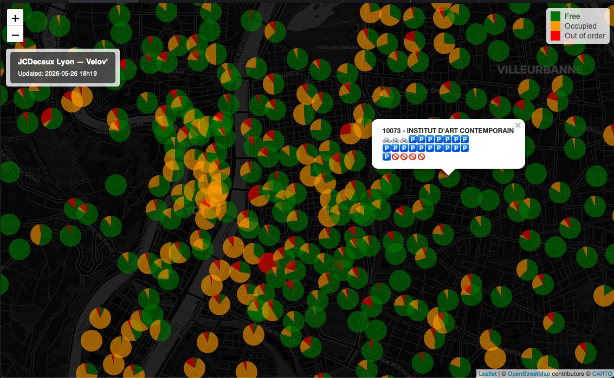

# Velib Map

A utility that polls the JCDecaux API at regular intervals and saves each snapshot of bike-sharing station availability as a `.jpg` map — designed to be stitched into a time-lapse animation.

Each circle's size reflects the station's total capacity (number of docks), and its color reflects whether the station is mostly free, mostly occupied, or out of service.

## Live map

[**View the live Lyon map →**](https://guillaumegso.github.io/JCDecaux_API_Playground/)


[](https://guillaumegso.github.io/JCDecaux_API_Playground/)

### How it's updated

The live map is rebuilt every hour by a GitHub Actions workflow ([.github/workflows/update-map.yml](.github/workflows/update-map.yml)):

1. **Schedule** — a cron trigger (`0 * * * *`) fires hourly. The workflow can also be run manually from the Actions tab.
2. **Build** — the runner installs R, pulls the JCDecaux data, and runs [update_index.R](update_index.R) to regenerate `docs/index.html` (a self-contained Leaflet map with pie-chart minicharts per station).
3. **Commit** — `stefanzweifel/git-auto-commit-action` commits the updated `docs/index.html` back to `main` with `[skip ci]` so the commit doesn't re-trigger the workflow.
4. **Publish** — GitHub Pages serves the `docs/` folder, so the new map is live within seconds of the commit.

## Setup

1. Get a free API key from [JCDecaux Developer](https://developer.jcdecaux.com/)
2. Create a `.Renviron` file at the project root:

```
JCDECAUX_API_KEY=your_key_here
```

3. Install dependencies in R:

```r
install.packages(c("jsonlite", "leaflet", "leaflet.minicharts", "htmlwidgets", "mapview"))
```

## Usage

```r
source("main.R")
```

The script polls every 10 minutes and saves a JPEG to `images/<city>/` on each poll (the output folder is created automatically).

To target a different city, edit the `city` variable in [main.R](main.R). Available cities can be listed via:

```
https://api.jcdecaux.com/vls/v1/contracts?apiKey=<YOUR_API_KEY>
```

> Note: Paris no longer uses JCDecaux.

## Files

| File | Description |
|------|-------------|
| `main.R` | Entry point — polling loop for local JPEG snapshots |
| `velib.R` | Fetches and parses station data from the API |
| `maps.R` | Renders and saves the leaflet map as a JPEG |
| `update_index.R` | Builds `docs/index.html` (the live web map) |
| `.github/workflows/update-map.yml` | Hourly Actions workflow that rebuilds and publishes the web map |
